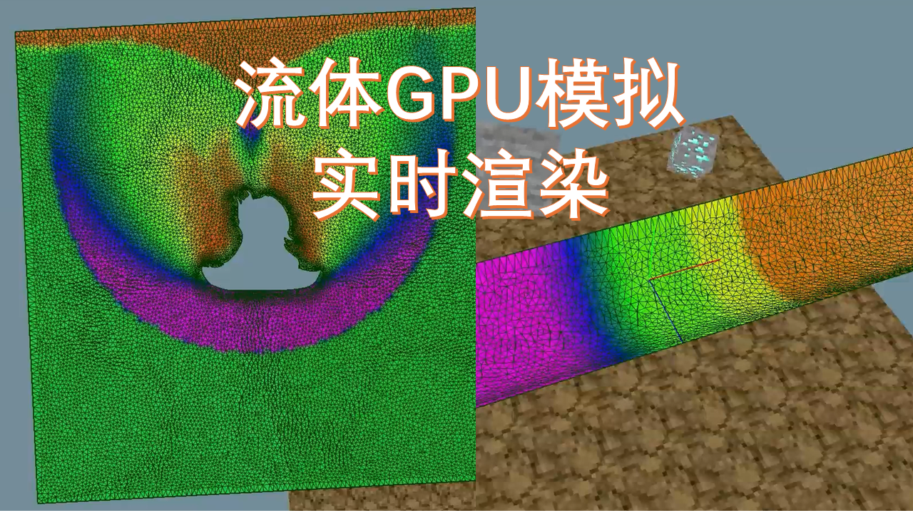
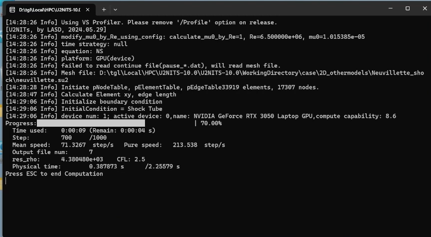

<p align="center">

</p>


# FVMR - a Realtime 2D Fluid Solver Based on GPU

[TOC]

## Introduction

[README in Chinese](./README_zh_cn.md)

FVMR (Finite Volume Method Realtime) is a 2D fluid solver written in C++/CUDA, based on the finite volume method and unstructured grids, capable of real-time visualization of solution results. This repository contains the project source code and example grids. The project runs on the Windows platform.

> Note: (2024-10-17) **Added the FVMR project (located in `/FVMR`), the old project U2NITS-10.0 is no longer maintained.** The README file is based on the new project.
>
> This README document **is under updates**. 

**Full Name:** Finite Volume Method Realtime

**Features:**

- CPU/GPU computation of 2D inviscid problems (experimentally validated)
- CPU/GPU computation of 2D Navier-Stokes equations for laminar flow problems (not fully validated, accuracy questionable)
- OpenGL real-time rendering. A simple OpenGL rendering framework
- ~~Experimental platform for physics engines~~ Cloth simulation, SPH simulation, etc.

**How to Write a Solver:**

(TODO)

**Videos:**

- [【Undergraduate Thesis】Handcrafted Fluid Solver implemented on GPU](https://www.bilibili.com/video/BV1dw3gerE2N/) 
- [GPU Real-time Rendering of FVM Solver](https://www.bilibili.com/video/BV19D1BYHEWW/)

**Version Notes:**

- FVMR

		Released on October 17, 2024. Added real-time rendering interface.

- U2NITS-10.0

		Released on June 25, 2024. Converted the program to GPU version.

## Installation

If you want to use it directly, please download the `/quick_start` directory (which includes executable files and example files), and jump to the [Quick Start](#Quick Start) section.

### Prerequisites

Requirements for compilation:

1. Download and install [CUDA Toolkit 12.3](https://developer.nvidia.com/cuda-downloads). For system requirements and installation guidelines, please refer to the [Linux Installation Guide](http://docs.nvidia.com/cuda/cuda-installation-guide-linux/) and the [Windows Installation Guide](http://docs.nvidia.com/cuda/cuda-installation-guide-microsoft-windows/index.html).
   
2. Download and install Visual Studio Community 2022.

3. Download the project source code. Theoretically, all environments should be configured, and you can directly compile and generate the exe file.

## Quick Start

FVMR: Open `/quick_start/FVMR` and run `FVMR.exe`.

> Before running, make sure the file `input.toml` contains the option [render]:
>
> ````toml
> [render]
> enable_print = true     # print progress in console
> enable_write_file = false # write file
> range_1 = 0          # colorbar lower limit
> range_2 = 1          # colorbar upper limit
> ````

U2NITS-10.0: Copy `U2NITS-10.0.exe` to the example directory in `U2NITS-10.0/quick_start`. Double-click to run it; a console window will appear, and the program will read the control parameters and grid.

For cases where the number of grids exceeds 10,000, the preprocessing (assembling edges and initializing the flow field) may be slow and sometimes take a few minutes, please be patient.

> Ensure that the exe file (`U2NITS-10.0.exe`), control parameter file (`input.toml`), and corresponding `.su2` grid files are in the same directory.
>
> If the program fails to run, it is usually due to a mismatch between the CUDA and graphics driver versions.
>
> If the program crashes unexpectedly, you can check the newly generated `LOG` file for any `Error` messages, which may indicate that the input parameters do not meet the requirements.
>
> For parameter settings, refer to: [Control Parameter Description](#控制参数说明).

Once the initialization is complete, a progress bar will appear in the console window, indicating that the computation is ongoing, as shown in the picture below.

<p align="center">

</p>

> Text Description Below the Progress Bar:
>
> - Mean speed: Computes the overall average speed, including the time spent on output files.
> - Pure speed: The speed of the pure computation part. It shows the instantaneous speed of the computation part for the current iteration step, which fluctuates greatly over time.

Press [ESC] to terminate the calculation, and you can resume next time.

After the calculation is completed, open the flow field file (.dat) with Tecplot. There are three types of output files:

- Flow field, for example, `ivortex[0001].dat`.
- Line graph, for example, `ivortex_hist.dat`. Used to describe the changes in lift and drag in airfoil/cylinder flow.
- Boundary data, for example, `ivortex_tec_boundary.dat`. In airfoil computations, it can be used to check pressure distribution.

Among them, line graphs and boundaries have many bugs. For instance, when calculating drag, I only integrated pressure without considering frictional drag, so the lift-to-drag coefficient curve is only applicable to inviscid flows.

Additionally, there are continuation files (`pause_ivertex[3351].dat`). When the control parameter `continue=true`, the program will search the directory for all files starting with `pause_`, and take the file with the highest number within the brackets for continuation. Files starting with `recovery_` are similar to those starting with `pause_` but are generally not needed; if you want to use them, you'll need to rename them to start with `pause_`.

## Documentation

[Doxygen](doc/doxygen/html/index.html)

### Third-Party Dependencies

The third-party dependencies are located in `/common`, which include:

- **Unused**: boost/pfr. Reflection
- **Unused**: Eigen. Matrix computation
- gl. OpenGL library
- imgui. UI library
- **Unused**: lua
- **Unused**: rttr. Reflection
- **Unused**: For convenient reading of lua
- toml. Input file parsing

### Third-Party Dependencies (Old Project)

> This section pertains to the old project `U2NITS-10.0`.

The third-party dependencies are included in the project directory `U2NITS-10.0/src/include` as header files, requiring no static or dynamic libraries. The list of dependencies is as follows:

- cpptoml: A file parsing library used for parsing toml-type control parameter files. It consists of a single file `cpptoml.h`; thus, it can be directly included without needing to be added to the solution.
- AMatrix: A matrix computation library. It includes `.cpp` files and must be added to the solution. This library is used by the function `Reconstructor::Element_T3_updateSlope_Barth` in `U2NITS-10.0/src/space/Reconstructor.cpp`.

The `U2NITS-10.0/src/include` directory also contains other dependency libraries that were previously used but are no longer needed, which mainly include:

- eigen: Matrix computation library. Currently, large sparse matrix calculations are not used, so the eigen library has been removed.
- rapidjson
- easyloggingpp
- stdgpu

### Control Parameter Description

#### Overview

The control parameters are named `input.toml`, which is a toml type file.

> If the program cannot find the `input.toml` file, it will prompt for the location of a `.toml` file, where you can manually enter the file name, such as `test.toml` or omit the suffix and just enter `test`.

The toml format is similar to JSON, using square brackets to denote the current parent node, with key-value pairs of all child nodes listed below.

> For the reading principle of control parameters, refer to the function `TomlFileManager::treeToGlobalParameter()` in `TomlFileManager.cpp`.

The following provides an example of the parameters in `/quick_start/U2NITS-10.0/Neuvillette_shock/input.toml`:

```toml
# 20240625
# filename: neuvillette
# 

[basic]
continue = true                 # Whether to continue computation. true-continuous, false-overwrite previous output results
dimension = 2                   # Dimension. Must be 2
filename = "neuvillette"        # Mesh file name
meshFileType = "su2"            # Mesh file extension, must fill su2
useGPU = 1                      # 0-CPU 1-GPU
isDebugMode = false             # Debug mode. If set to true, debug results will be output when reading input parameters fails

[constant]
T0 = 288.16                     # Sea level temperature reference
p0 = 101325.0                   # Sea level pressure reference
Re = 6.5e6                      # Reynolds number
Pr = 0.73                       # Prandtl number. Used when calculating viscosity coefficient
gamma = 1.4                     # Ratio of specific heats
referenceArea = 1               # (3D case) Reference area, or (2D case) Reference chord length, used when calculating pressure coefficients
calculate_mu0_by_Re = true      # Calculate viscosity coefficient based on Re

[initialCondition]
type = 3                        # 1-infinite uniform flow 2-isentropic vortex 3-shock tube 4-double Mach reflection

[initialCondition.shockTube]    # Effective only in "3-shock tube" mode
shock_x = 0                     
shock_y = 0.5                   
shock_normal_x = 0
shock_normal_y = 1

[boundaryCondition.2D.inlet]    
input_mode = 1                  # 0-{Ma,AoA} 1-{rho,u,v,p} 2-{rho,rhou,rhov,rhoE} 3-{rho, u, angle_degree, p}
rho = 8
u = 0
v = 8.25
p = 116.5

[boundaryCondition.2D.outlet]
input_mode = 1
rho = 1.4
u = 0
v = 0
p = 1

[output]
step_per_print = 50             # Progress bar refresh frequency. E.g., refresh once every 50 steps
step_per_output_field = 100     # Flow field output frequency. Output file name will be `neuvillette[0001].dat`
step_per_output_hist = 100      # Line graph output frequency. Output file name will be `neuvillette_hist.dat`
maxIteration = 12000            # Maximum number of iterations, used for termination
tolerace_residual = 1e-7        # Residual below this value considered steady state

[output.output_var]             # Which variables to output
rho = true
u = true
v = true
p = true

[physicsModel]
equation = 2                    # 1-Euler, 2-NS

[time]
is_steady = 0                   # 0-unsteady 1-steady. Currently, steady state easily diverges, only unsteady can be used
is_explicit = 1                 # 0-implicit   1-explicit. Currently, only explicit can be used
CFL = 2.5                       # CFL number, used in unsteady mode
CFL_steady = 0.8                # CFL number, used in steady mode
max_physical_time = 2.255788    # Maximum physical time, used for termination
time_advance = 3101             # 3101-explicit single step, 3103-RK3. RK3 not fully developed in GPU mode

[inviscid_flux_method]
flag_reconstruct = 3002         # 3001-constant reconstruction 3002-linear reconstruction 3003-MUSCL interpolation
flag_gradient = 2               # 1-least squares 2-GreenGauss. Can only use GreenGauss in GPU mode
flux_conservation_scheme = 2002 # 2001-LocalLaxFriedrichs, 2002-Roe
flux_limiter = 1                # 0-none 1-barth 2-minmod 3-vanleer Only barth limiter currently supported
```

#### Initial and Boundary Conditions

This section discusses the initialization of boundary and internal fields.

Boundary condition initialization is generally determined by the boundary types defined in the `.su2` file.

When exporting a `.su2` file using Pointwise, you need to set the boundary names; the program will set the boundary conditions based on these names. Multiple names can correspond to a single boundary, as shown below:

- Solid wall: wall, obstacle, airfoil, foil
- Slip wall: wall_nonViscous, wall_slippery, slippery, slippery_wall
- Inlet: inlet
- Outlet: outlet
- Far field: inf, infinity, far, farfield
- Symmetry: symmetry
- Periodic: periodic
- Dynamic boundary for double Mach reflection (time-dependent): dsr

> 1. This part of the source code is located in the function `BoundaryManager::boundaryNameToType(std::string boundaryName)`
>
> 2. Inlet, outlet, and far field are all computed based on the far field, but the boundary parameters can differ. The conditions for specified density flow or specified pressure at the inlet have not yet been completed.

For **inlet, outlet, and far field boundary conditions**, you should add the options `[boundaryCondition.2D.inlet]`, `[boundaryCondition.2D.outlet]`, `[boundaryCondition.2D.inf]` in the control parameters and provide parameter values. The solver will use these values to compute the boundary cell values during the calculation. There are four methods for setting the parameter values (the corresponding `input_mode` needs to be set), for example, you can specify the Mach number and angle of attack (`input_mode=1`), or you can specify raw variable values, as well as conservation variable values.

**Symmetry boundaries** are not fully developed, and their use is not recommended. They are treated as non-slip wall surfaces in non-viscous solvers.

**Periodic boundaries** are special; after exporting from Pointwise, you need to manually modify the boundary names, as Pointwise automatically merges boundaries with the same name.

**Double Mach reflection boundaries** have specific requirements for mesh size and control parameters. Please refer to the example files in `quick_start/2D_double_shock_reflect`.

> The dsr boundary for double Mach reflection will calculate which boundaries are located to the left of the shock at each moment. The boundary elements to the left of the shock will be assigned inlet parameters, while those to the right will be assigned outlet parameters. Since the shock speed is fixed in this calculation, the shock must be at a 60° angle, and the Inlet and outlet parameters cannot be arbitrarily modified.
>
> The double Mach reflection case requires the bottom wall surface to be a non-slip wall surface.

The initialization of internal fields is primarily determined by `[initialCondition]`, which is categorized into four types:

- 1-infinite: The entire field is initialized with inf
- 2-Isentropic vortex: The entire field is initialized with inf and superimposed with an isentropic vortex
- 3-Shock tube: According to the shock position, the regions on both sides of the shock are initialized with inlet and outlet values
- 4-Double Mach reflection: According to the shock position, the regions on both sides of the shock are initialized with inlet and outlet values

Files should be saved in UTF-8 format.

> For initialization code, refer to `FieldInitializer::setInitialAndBoundaryCondition()`

```toml
# Effective only in "3-shock tube" mode. Defines a line using point + normal vector
# If not specified, defaults to x=0, y=0, normal_x=1, normal_y=0
[initialCondition.shockTube]    
shock_x = 0                     
shock_y = 0.5                   
shock_normal_x = 0 # Normal vector of the line. The normal vector points from the inlet side to the outlet side
shock_normal_y = 1

# Effective only in "4-double Mach reflection" mode. Defines a line using the point-slope form
[initialCondition.doubleShockReflection]
shock_x = 0.6
shock_y = 0 
shock_angle_degree = 60 # Angle between the line and the x-axis
```

### Code Description

(Updating)

The `/FVMR/src/legacy` directory contains older legacy code.

```
BoundaryManager_2D.cpp
BoundaryManager_2D.h
Edge_2D.cpp
Edge_2D.h
Element_2D.cpp
Element_2D.h
FVM_2D.cpp
FVM_2D.h
head.h
Node_2D.cpp
Node_2D.h
```

Currently, their role is to assemble data when reading the mesh file. They are called by `SU2MeshReader`, converted by `OldDataConverter`, and passed to the current new system `GPU::GPUSolver2`.

> This project is inherited from my previous Euler solver `FVM_2D`. At that time, I used dynamic arrays `std::vector` for storage, employing an Array of Structure (AoS) layout. However, I now need to switch to a Structure of Array to better accommodate the GPU, requiring the use of OldDataConverter for conversion.
>
> Right now, this legacy code is a complete mess, seriously affecting the speed of mesh reading. However, if this mess can run, it is recommended to avoid altering it for the time being.

## Communication

- GitHub Issues: Bug reports, feature requests, install issues, RFCs, thoughts, etc.

## Star History

[](https://star-history.com/#OliveTIen/CFD_Solver_2D_GPU&Date)
