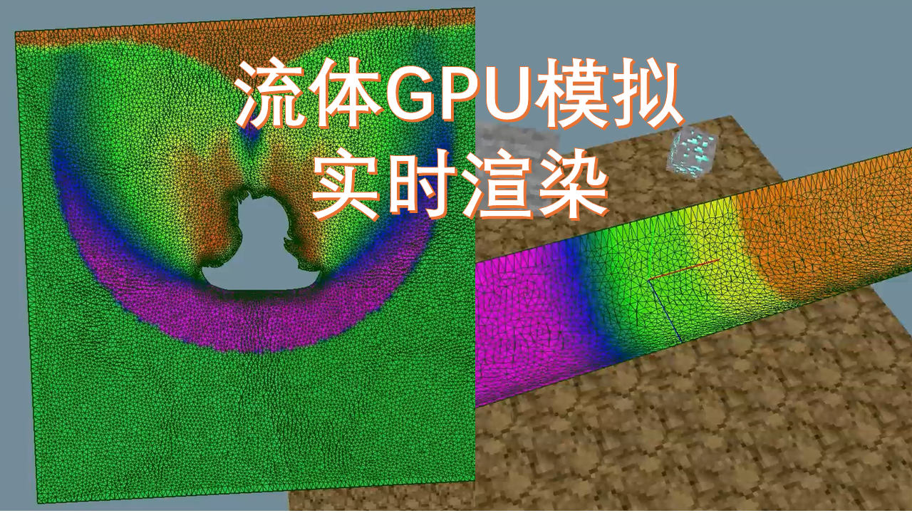





# FVMR-基于GPU的二维流体实时求解器

[TOC]

## 简介

FVMR (Finite Volume Method Realtime) 是一个用C++/CUDA编写的二维流体求解器，它基于有限体积方法和非结构网格，能够实时显示求解结果。该仓库包含了项目源码和示例网格。该项目基于Windows平台运行。

> 注：（2024-10-17）**添加了FVMR项目（位于`/FVMR`），旧项目U2NITS-10.0不再维护**，README文件以新项目为准。
>
> 此README文档**正在更新中**。

**全称：**Finite Volume Method Realtime

**功能：**

- CPU/GPU计算二维无粘问题（已实验验证）
- CPU/GPU计算二维N-S方程层流流动问题（未经过充分验证，准确性存疑）
- OpenGL实时渲染。简易的OpenGL渲染框架
- ~~物理引擎的试验平台~~布料模拟、SPH模拟等

**如何写求解器：**

（TODO）

**视频：**

- [【本科毕设】手搓流体求解器，并用GPU实现](https://www.bilibili.com/video/BV1dw3gerE2N/) 
- [FVM求解器的GPU实时渲染](https://www.bilibili.com/video/BV19D1BYHEWW/)

**版本说明：**


- FVMR

​		2024年10月17日发布。添加了实时渲染界面

- U2NITS-10.0

​		2024年6月25日发布。把程序改造成GPU版本


## 编译

如果想直接使用，请下载`/quick_start`目录（里面可执行程序和示例文件），并跳转到[快速开始](#快速开始)部分。

### 前置条件

编译所需条件：

下载并安装 [CUDA Toolkit 12.3](https://developer.nvidia.com/cuda-downloads) 。系统要求和安装指南请参见 [Linux Installation Guide](http://docs.nvidia.com/cuda/cuda-installation-guide-linux/) 和 [Windows Installation Guide](http://docs.nvidia.com/cuda/cuda-installation-guide-microsoft-windows/index.html).。

下载并安装 Visual Studio Community 2022。

下载项目源码。理论上所有环境已经配置好了，可以直接编译、生成exe文件。


## 快速开始

（新项目）打开`/quick_start/FVMR`，双击`FVMR.exe`运行。

> 相比旧项目，新项目的input.toml文件多了[render]选项：
>
> ````toml
> [render]
> enable_print = true     # 控制台打印求解进度
> enable_write_file = false # 输出文件
> range_1 = 0          # colorbar的下限
> range_2 = 1          # colorbar的上限
> ````


（旧项目）将U2NITS-10.0.exe复制到`/quick_start/U2NITS-10.0`的示例目录。双击运行，出现控制台窗口，程序会读取控制参数和网格。

对于网格数超过1万的情况，前处理（组装边、初始化流场）会比较慢，有时候需要几分钟时间，请耐心等待。

> 应确保exe文件（`U2NITS-10.0.exe`）、控制参数文件（`input.toml`）和对应`.su2`网格文件位于同一目录下。
>
> 如果程序无法运行，一般是CUDA和显卡驱动版本不匹配问题。
>
> 如果程序闪退，可以检查新生成的`LOG`日志文件，查找是否有`Error`信息，可能是因为输入参数不符合要求导致的。
>
> 关于参数设置，参见：[控制参数说明](#控制参数说明)

初始化完成后，控制台窗口会出现进度条，表示正在计算，如图所示。


> 进度条下方文字说明：
>
> - Mean speed: 计算总平均速度，包含输出文件耗时
> - Pure speed: 纯计算部分速度。它显示了当前迭代步的计算部分的瞬时速度，随时间波动较大

按[ESC]可以终止计算，下次可以续算。

计算完成后，用tecplot打开流场文件(.dat)即可。共有三种输出文件

- 流场。例如`ivortex[0001].dat`。
- 线图。例如`ivortex_hist.dat`。在翼型/圆柱绕流中，用来描述升阻力变化
- 边界。例如`ivortex_tec_boundary.dat`。在翼型计算中，可以用来查看压力分布

其中线图和边界bug比较多。例如我在计算阻力时仅积分了压力，没有考虑摩擦阻力，因此升阻力系数曲线仅适用于无粘流动。

此外还有续算文件(`pause_ivertex[3351].dat`)。当控制参数中`continue=true`时，程序会搜索目录中所有以`pause_`开头的文件，并在其中取方括号中的数值最大的文件，进行续算。`recovery_`开头的文件和`pause_`开头的文件类似，一般用不到，如果要使用，需要改名为`pause_`开头的文件。


`/quick_start/U2NITS-10.0`文件目录介绍：

- 2D_Neuvillette_shock：激波冲击那维莱特问题
  - pw是pointwise文件，用于输出.su2网格
  - su2是网格文件
  - lay是tecplot样式文件，sty是tecplot的frame样式文件


## 文档

### 第三方依赖

第三方依赖位于`/common`，包括：

- 【未使用】boost/pfr。反射
- 【未使用】Eigen。矩阵计算
- gl。OpenGL库
- imgui。UI库
- 【未使用】lua
- 【未使用】rttr。反射
- 【未使用】方便读取lua
- toml。输入文件解析


### 第三方依赖（旧项目）

> 该部分内容属于旧项目

第三方依赖已包含进项目目录`U2NITS-10.0/src/include`中，均为头文件形式，无需静态库或动态库。依赖项目列表如下：

- cpptoml：文件解析库，用于解析toml类型的控制参数文件。它只有一个文件`cpptoml.h`，因此使用时可以直接包含，无需添加到解决方案中。
- AMatrix：矩阵运算库。它包含`.cpp`文件，因此需要添加到解决方案中。
  该库在`U2NITS-10.0\src\space\Reconstructor.cpp`中被函数`Reconstructor::Element_T3_updateSlope_Barth`使用。

`U2NITS-10.0/src/include`目录中还有其他依赖库，这些库是曾经使用过但现在不再需要的，主要包括：

- eigen：矩阵运算库。目前没用到大型稀疏矩阵计算，已移除eigen库
- rapidjson
- easyloggingpp
- stdgpu


### 控制参数说明

#### 总览

控制参数命名为`input.toml`，为toml类型文件。

> 如果程序找不到`input.toml`文件，会询问`.toml`文件的位置，此时可以手动输入文件名，例如`test.toml`或者省略后缀`test`。

toml类型类似json，它用方括号表示当前父节点，下方列出所有子节点的键值对。

> 控制参数的读取原理参见`TomlFileManager.cpp`中的函数`TomlFileManager::treeToGlobalParameter()`

以`/quick_start/U2NITS-10.0/Neuvillette_shock/input.toml`为例介绍各参数

```toml
# 20240625
# filename: neuvillette
# 

[basic]
continue = true                 # 是否续算。true-续算，false-覆盖之前输出结果
dimension = 2                   # 维度。只能填2
filename = "neuvillette"        # 网格文件名
meshFileType = "su2"            # 网格文件后缀名，只能填su2
useGPU = 1                      # 0-CPU 1-GPU
isDebugMode = false             # 调试模式。设为true，则会在读取输入参数失败时输出调试结果

[constant]
T0 = 288.16                     # 海平面温度参考
p0 = 101325.0                   # 海平面压力参考
Re = 6.5e6                      # 雷诺数
Pr = 0.73                       # 普朗特数。计算粘性系数时会用到
gamma = 1.4                     # 比热比
referenceArea = 1               # (三维算例)参考面积，或(二维算例)参考弦长。在求压力系数时会用到
calculate_mu0_by_Re = true      # 根据Re计算粘度系数

[initialCondition]
type = 3                        # 1-inf均匀流 2-等熵涡 3-激波管 4-双马赫反射

[initialCondition.shockTube]    # 仅在"3-激波管"模式下有效
shock_x = 0                     
shock_y = 0.5                   
shock_normal_x = 0
shock_normal_y = 1

[boundaryCondition.2D.inlet]    
input_mode = 1                  # 0-{Ma,AoA} 1-{rho,u,v,p} 2-{rho,rhou,rhov,rhoE} 3-{rho, u, angle_degree, p}
rho = 8
u = 0
v = 8.25
p = 116.5

[boundaryCondition.2D.outlet]
input_mode = 1
rho = 1.4
u = 0
v = 0
p = 1

[output]
step_per_print = 50             # 进度条刷新频率。例如50步刷新1次
step_per_output_field = 100     # 流场文件输出频率。输出文件名为`neuvillette[0001].dat`
step_per_output_hist = 100      # 线图文件输出频率。输出文件名为`neuvillette_hist.dat`
maxIteration = 12000            # 最大迭代步数，用于终止
tolerace_residual = 1e-7        # 残差低于此值认为达到稳态

[output.output_var]             # 输出哪些变量
rho = true
u = true
v = true
p = true

[physicsModel]
equation = 2                    # 1-Euler, 2-NS


[time]
is_steady = 0                   # 0-非定常 1-定常。目前定常容易发散，只能用非定常
is_explicit = 1                 # 0-隐式   1-显式。目前只能用显式
CFL = 2.5                       # CFL数，非定常模式下使用
CFL_steady = 0.8                # CFL数，定常模式下使用
max_physical_time = 2.255788    # 最大物理时间，用于终止
time_advance = 3101             # 3101-显式单步推进，3103-RK3。GPU模式下RK3未开发完成


[inviscid_flux_method]
flag_reconstruct = 3002         # 3001-常量重构 3002-线性重构 3003-MUSCL插值
flag_gradient = 2               # 1-最小二乘 2-GreenGauss。GPU模式下只能用GreenGauss
flux_conservation_scheme = 2002 # 2001-LocalLaxFriedrichs, 2002-Roe
flux_limiter = 1                # 0-none 1-barth 2-minmod 3-vanleer 目前只支持barth限制器

```

#### 初边值条件

下面介绍边界和内部场的初始化。

边界条件初始化一般根据.su2中的边界类型确定。

用pointwise导出.su2文件时，需要设置边界名称，程序会根据名称设置边界条件，多个名称可以对应到一种边界，对应关系如下

- 固壁：wall, obstacle, airfoil, foil
- 滑移壁：wall_nonViscous, wall_slippery, slippery, slippery_wall
- 入口：inlet
- 出口：outlet
- 远场：inf, infinity, far, farfield
- 对称：symmetry
- 周期：periodic
- 双马赫反射的动态边界(随时间变化)：dsr

> 1.该部分源码位于函数`BoundaryManager::boundaryNameToType(std::string boundaryName)`
>
> 2.入口、出口、远场实际上都是按照远场来计算，不过边界参数可以不同。目前还没完成给定密度流量或给定压力的入口条件。

对于**入口、出口、远场边界条件**，应该在控制参数中添加`[boundaryCondition.2D.inlet]`、`[boundaryCondition.2D.outlet]`、`[boundaryCondition.2D.inf]`选项，并给定参数值，求解器在计算边界时会使用这些值来计算边界单元值。有四种给定参数值的方法(需要设置对应的`input_mode`)，例如可以给定马赫数、攻角(`input_mode=1`)，也可以给定原始变量值，还可以给定守恒量值。

**对称边界**尚未开发完善，不建议使用。在无粘求解器中它按照无滑移壁面处理。

**周期边界**比较特殊，用pointwise导出后，还需要手动修改边界名称，因为pointwise会自动将相同名称的边界合并。

**双马赫反射边界**对网格尺寸和控制参数都有固定要求，具体参照`quick_start/2D_double_shock_reflect`中的示例文件。

> 双马赫反射的dsr边界会在每个时刻计算哪些边界位于激波左侧，激波左侧的边界元赋值为inlet参数，右侧的赋值为outlet参数。由于该计算中激波移动速度是固定死的，因此要求激波必须是60°角，且Inlet、outlet参数都不能随便改。
>
> 双马赫反射算例要求底部壁面为无滑移壁面。

内部场的初始化主要由`[initialCondition]`决定，它分为四种。

- 1-inf：全场用inf初始化
- 2-等熵涡：全场用inf叠加等熵涡初始化
- 3-激波管：根据激波位置，对激波两侧分别用inlet和outlet初始化
- 4-双马赫反射：根据激波位置，对激波两侧分别用inlet和outlet初始化

文件用UTF-8格式保存

> 初始化代码可参考`FieldInitializer::setInitialAndBoundaryCondition()`

```toml
# 仅在"3-激波管"模式下有效。用点+法向量确定一条直线
# 如果不指定，默认x=0,y=0,normal_x=1,normal_y=0
[initialCondition.shockTube]    
shock_x = 0                     
shock_y = 0.5                   
shock_normal_x = 0# 直线法向量。法向量从inlet侧指向outlet侧
shock_normal_y = 1

# 仅在"4-双马赫反射"模式下有效。用点斜式确定一条直线
[initialCondition.doubleShockReflection]
shock_x = 0.6
shock_y = 0 
shock_angle_degree = 60# 直线与x轴夹角
```

### 代码说明

(更新中)

`/FVMR/src/legacy`目录中是以前的遗留代码

```
BoundaryManager_2D.cpp
BoundaryManager_2D.h
Edge_2D.cpp
Edge_2D.h
Element_2D.cpp
Element_2D.h
FVM_2D.cpp
FVM_2D.h
head.h
Node_2D.cpp
Node_2D.h
```

现在它们现在所起的作用就是在读取网格文件时组装数据，被`SU2MeshReader`调用，通过`OldDataConverter`转换，传递到当前的新系统`GPU::GPUSolver2`。

> 该项目继承自我以前写的欧拉求解器`FVM_2D`。当时我是用的动态数组`std::vector`存储，且使用的Array of Structure(AoS)结构。但是现在我需要改为Structure of Array以更好适配GPU，因此需要用OldDataConverter进行转换。
>
> 现在这些遗留代码就是一坨屎山，严重影响了读取网格的速度。然而屎山能运行就尽量先不要动它

## 交流

欢迎提Issue

# 经验总结

## 如何写二维求解器


## 参考资料

一维激波管问题的Python解析解参考[一维激波管问题（知乎）]([一维激波管问题（本科毕业论文） - 知乎 (zhihu.com)](https://zhuanlan.zhihu.com/p/154508317))。代码位于`quick_start/1D_shocktube`下。

双马赫反射问题与WENO对比，WENO来自参考文献

```
Ji Z, Liang T, Fu L. A Class of New High-order Finite-Volume TENO Schemes f
or Hyperbolic Conservation Laws with Unstructured Meshes[J]. Journal of Scientific
Computing, 2022,92(2):61.DOI:10.1007/s10915-022-01925-5.
```


## Visual Studio 配置宏介绍

在设置VS项目属性时，可采用宏来简化路径

来源：https://blog.csdn.net/qianniulaoren/article/details/133160383
也可以在项目属性中点击任意项-编辑，展开宏，以进行浏览。
如果在常规的浏览中找不到，可以在调试的浏览中找
```
$(TargetDir)                                           # 目标输出文件所在的目录
$(TargetName) = U2NITS-10.0                            # 目标的名称
$(TargetExt) = .exe                                    # 目标的扩展名
$(TargetFileName) = $(TargetName)$(TargetExt)          # 目标输出文件名，包括扩展名
$(TargetPath) = $(TargetDir)$(TargetFileName)                      

$(SolutionDir) = D:\tgl\Local\HPC\U2NITS-10.0\         # 解决方案目录，即主目录
$(SolutionName) = U2NITS-10.0
$(SolutionExt) = .sln
$(SolutionFileName) = $(SolutionName)$(SolutionExt)    # .sln文件全名
$(SolutionPath) = $(SolutionDir)$(SolutionFileName)    # .sln文件全路径

$(Platform) = x64                                      # 解决方案平台名称，如x86、x64
$(Configuration) = Debug                               # 当前的编译配置名称，如Release、Debug
$(IntDir) = $(Platform)\$(Configuration) = x64\Debug\  # 编译器使用的中间目录，产出obj文件

$(ProjectName) = U2NITS-10.0                           # 当前工程名称
$(ProjectDir) = $(SolutionDir)$(ProjectName)\
              = D:\tgl\Local\HPC\U2NITS-10.0\U2NITS-10.0\ # 项目目录

$(OutDir) = $(SolutionDir)$(Platform)\$(Configuration)\
          = D:\tgl\Local\HPC\U2NITS-10.0\x64\Debug\    # 输出目录 该目录下生成exe pdb等文件
```
例如我将调试的工作目录修改为$(ProjectDir)WorkingDirectory\。设置后注意点“应用”

## 一些想法

目前有以下可完善方向：

- 添加湍流模型。如果不是为了发明新模型的话，只需要把已有湍流模型往上套即可
- 改造为3维。其难度比二维大得多，因为网格非常麻烦。而且计算量也涨了一个维度。
- 流固耦合。涉及到非结构动网格。这是我比较感兴趣的地方。目前只能做小变形，即网格的拓扑不能变，不能断裂。如果做嵌套网格的话也太麻烦。

